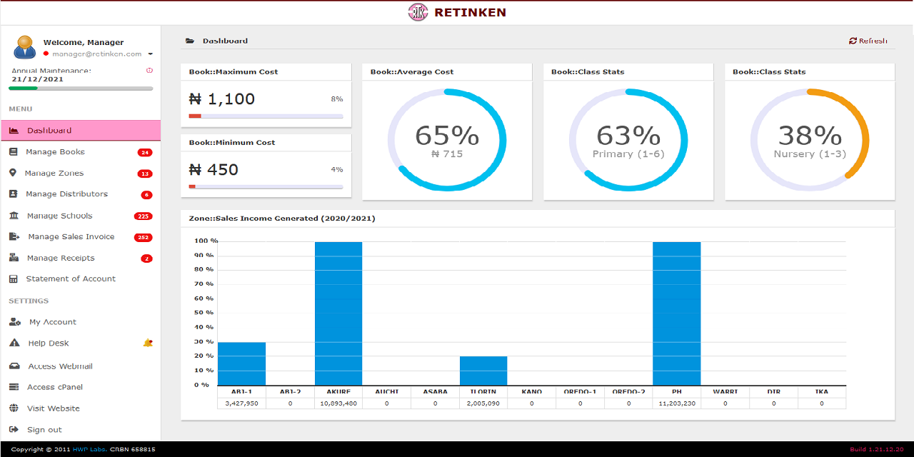

# RTK - Retinken Nig. Ltd.

Book Sales & Distribution Management Software

[](https://www.w3schools.com/html/default.asp)
[](https://www.w3schools.com/css/default.asp)
[](https://www.w3schools.com/js/default.asp)
[](https://www.w3schools.com/php/default.asp)
[](https://www.w3schools.com/mysql/default.asp)

## Installation 

```
$ git clone https://github.com/2gbeh/rtk.git

$ cd rtk
```

## Usage

1. Start `Apache Server` and visit http://localhost/phpmyadmin
  
2. Create a new database `rtk_db` and import the [database dump]( https://github.com/2gbeh/zentry-eas/blob/main/data/rtk_db.sql)

3. Visit http://localhost/rtk

## Documentation


